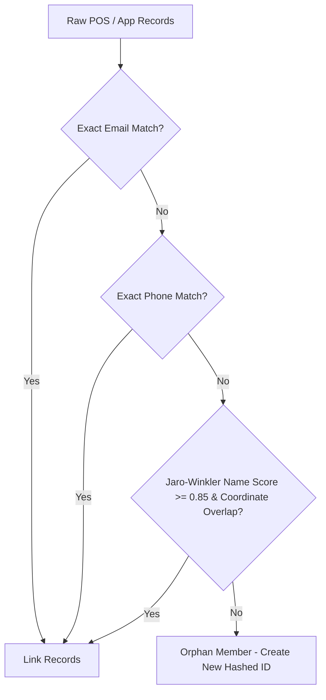

# Identity Resolution Playbook (Phase 5)

This handbook governs the design rules, normalisation heuristics, matching hierarchies, and operational procedures for merging multi-source member identifiers across HOTWORX POS systems (SailPOS), App Databases, and Marketing platforms (HW Campaign).

---

## 📐 Fields Standardisation Rules

To reduce noise and token variance before matching, we apply the following heuristics:

### 1. Emails
- Lowercase all characters, strip surrounding whitespace.
- *Rule*: Gmail dot-filtering and plus-routing can be optionally resolved (e.g. `john.doe+promo@gmail.com` maps to `johndoe@gmail.com`).

### 2. Phone Numbers
- Strip all non-digit characters (`(`, `)`, `-`, ` `, `+`).
- For standard US/Canada formats: strip leading country indicator `1` if the string contains 11 digits total (reducing it to a 10-digit national number).

### 3. Names
- Lowercase, strip surrounding whitespace.
- Retain only alphanumeric characters and single whitespace spacing.
- Strip typical suffixes (`jr.`, `sr.`, `iii`, `dds`, `phd`, `md`).

---

## 🎯 Match Hierarchy Logic

We resolve customer profiles sequentially using a **deterministic-to-probabilistic** cascade:

1. **Exact Email Match**: The highest confidence connection.
2. **Exact Phone Match**: Used if emails are missing or mismatch (e.g., secondary personal email used on App register).
3. **Fuzzy Name Match with Coordinate Overlap**: Matches if name similarity is high ($\ge 0.85$ Jaro-Winkler) and *either* the phone area code matches or the email prefix (before the `@`) matches.

---

## 🛠️ Conflict Resolution Playbook

In production, conflicts like duplicate keys will emerge:

### Case A: Shared Email Address (e.g., family plans)
* **Conflict**: Two distinct POS IDs (`M001`, `M002`) map to the same email address.
* **Resolution**: The exact email match layer is skipped. The pipeline falls back to Phone number match, and then fuzzy name matches to route `M001` and `M002` to distinct records.

### Case B: Hashed ID Collision
* **Conflict**: Hashing two emails yields the same `hashed_member_id`.
* **Resolution**: Hashing uses SHA-256 with a unique pepper/salt (`HOTWORX_IDENTITY_SALT`), making collision probability mathematically negligible ($< 10^{-60}$).
